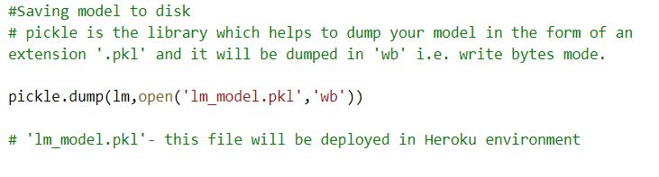
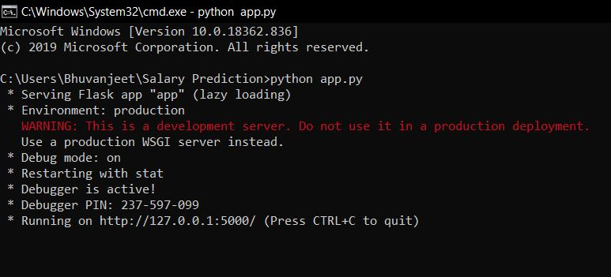
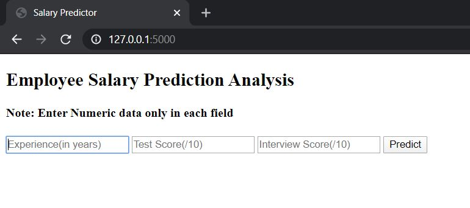
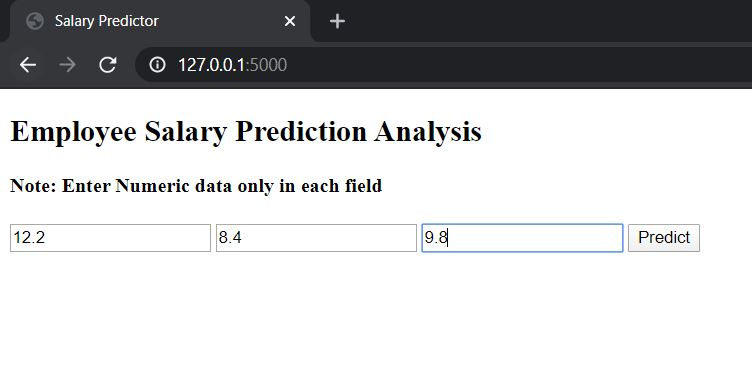
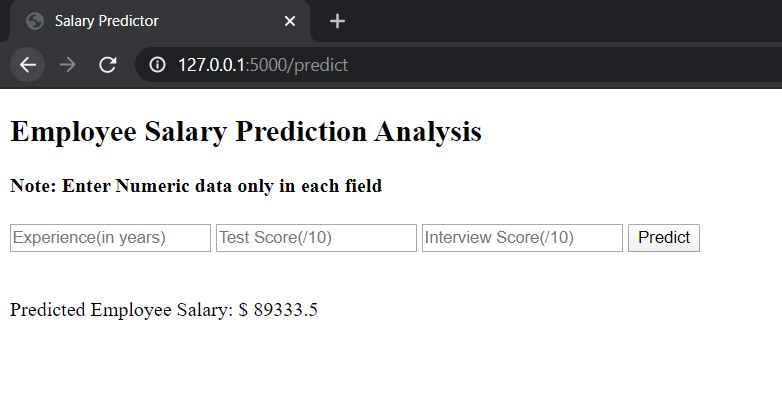
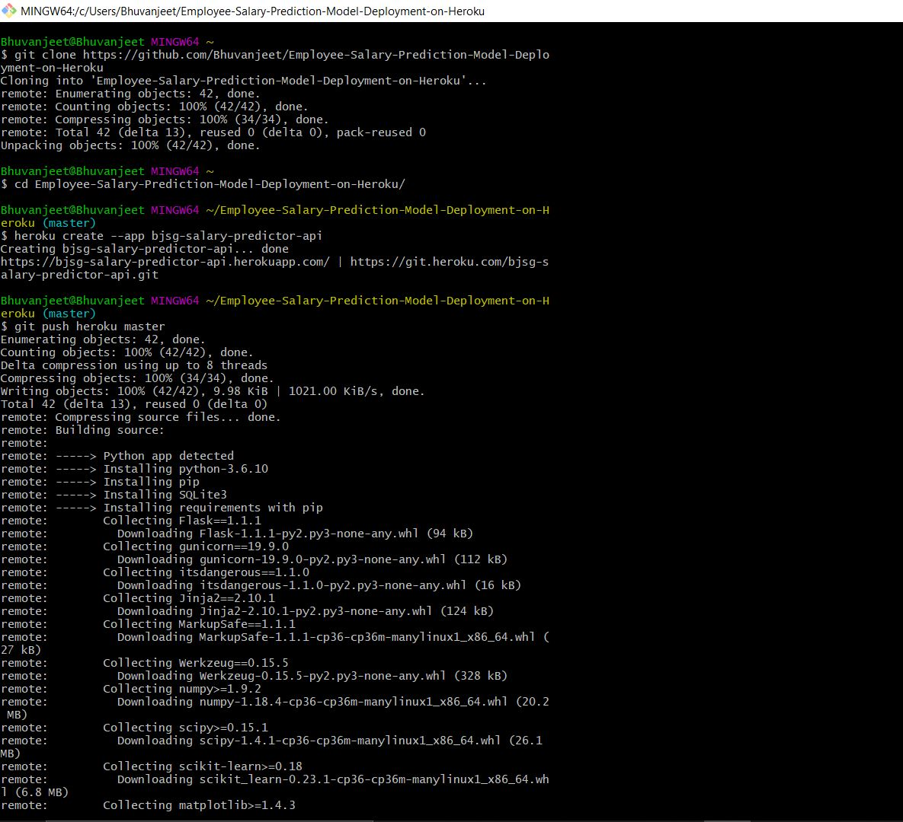
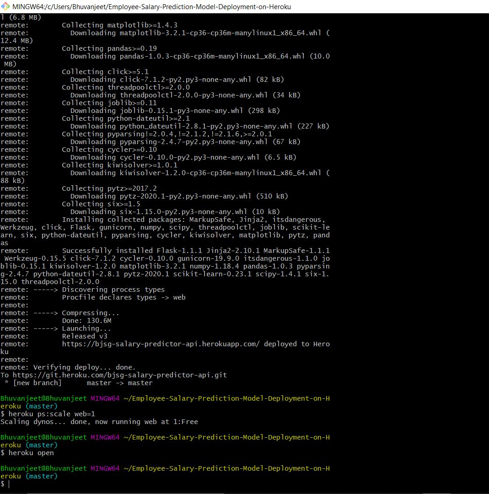
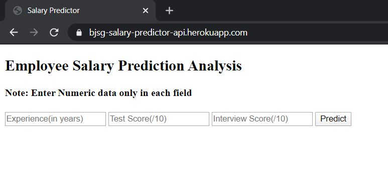

# Employee-Salary-Prediction-Model-Deployment-on-Heroku

ML Model deployed on Heroku using Flask micro web framework.

Checkout the WebApp at:- https://bjsg-salary-predictor-api.herokuapp.com/

## Project Overview:

In this project , a Linear regression model is deployed on Heroku using Flask.

**1- 'ml_model'** file is created. In this file , linear regression is applied on the dataset 'hiring.csv'.

Source of dataset: https://www.kaggle.com/pankeshpatel/hiring

The dataset contains the following attributes. 

Experience, Test Score, Interview Score are feature attributes and **Salary is target attribute.**

Experience: Total number of experience in years

Test score: score earned by a candidate in test

interview score: score earning by a candidate in interview

Salary : Salary offered to the candidate

As soon as you will run this file, **'lm_model.pkl'** file will be created automatically.

**2- 'app.py'** file is the flask app. Flask is a web framework. This means flask provides you with tools, libraries and technologies that allow you to build a web application. In the case of Flask, its dependencies are:

1- Werkzeug a WSGI utility library

2- jinja2 which is its template engine

This app makes connection between the webpage and ml_model.

**3- 'templates/index.html'** is the basic webpage made in html which takes input from the user and shows output, as predicted by the ml_model.

After making these files, just open Command Prompt, locate the project and type: 

python app.py

We will get a local IP Address - http://127.0.0.1:5000/ which will look something like this: 

On entering values:

On clicking the **'Predict'** button , we will get **Predicted Employee Salary**:

But this local environment will not be publicly available to everyone. So we will deploy it on Heroku - Heroku is a cloud platform as a service supporting several programming languages.

## Deploying on Heroku:

For deploying it on Heroku, we have to make 2 more files:

**1- 'Procfile'** - 'Procfile' is a mechanism for declaring what commands are run by your application's dynos on the Heroku platform. It basically tells heroku, which is the first file you want to execute.

Basic format for webapp:- web:gunicorn filename:flask_app_name

**2- 'requirements.txt'** - The 'requirements. txt' file lists the app dependencies together. When an app is deployed, Heroku reads this file and installs the appropriate Python dependencies using the pip install -r command. Make sure to install all these requirements on your system as well.

Now make a github repository and upload all these files in the repository.

Now goto 'heroku.com' and 'sign up' there. Create your account and download 'Heroku CLI'. 

Now, open Command Prompt and type - heroku login

This will connect heroku with your CLI.

Now, open gitbash and type:

1- git clone link_of_your_repo

2- cd repo_name

3- heroku create --app name_of_app_you_want

4- git push heroku master

5- heroku ps:scale web=1

6- heroku open

Now, the app is deployed and is visible at: https://bjsg-salary-predictor-api.herokuapp.com/

There are other tools as well, to deploy ML model. One of them is 'Tensorflow Serving', which is gaining a lot of popularity these days.